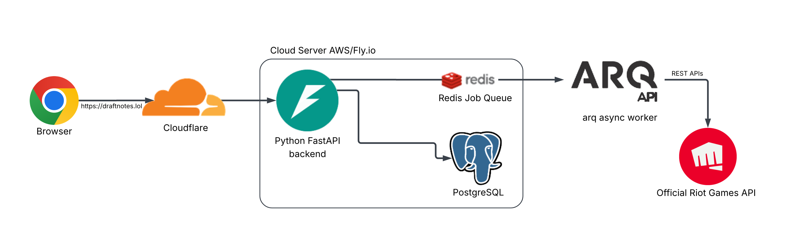

# DraftNotes

A performance review tool for a competitive eSports title.

**Currently live at: https://draftnotes.lol**


backend dev: Adi D


frontend dev: Alex J


## Use Case / Idea
Competitive games such as Chess, require thorough review of previous games for a noticable improvement in skill. The best players will go through their games move by move and take notes on mistakes and key moments in their matches to learn.

The same concept applies to the world's biggest competitive eSports title League of Legends by Riot Games.

As the LoL World Cup 2026 is set to take place in New York and only a couple months away, thousands of professional players across the world are working hard to hone their skill.

The primitive way to take notes is to use the native tools on windows, such as notepad or spreadsheets.
This is tedious and often distracting, so this project aims to create an application that helps users improve their gameplay by displaying all information about their previous matches in one place. 

This allows them to analyse their previous matches, create notes and tags for them so that they can improve their performance over time by marking repeated mistakes and identifying recurring patterns.


## Technical Details
The project is currently in live production using scalable cloud technologies, intended to hopefully serve atleast 10,000 users with its current infrastructure.


This is an end to end project with backend API, async worker, database schema, frontend, containerisation, CI/CD pipeline and cloud deployment.

This project was developed using an **Agile Development** cycle.

---

## System Architecture

<p align="center">
  
</p>


---

## Technologies

| Component | Role | Version |
|-----------|------|---------|
| **FastAPI** | Async web framework - REST API, dependency injection, OpenAPI generation | 0.115+ |
| **Python** | Backend language | 3.13 |
| **SQLAlchemy** | ORM - async sessions, `Mapped` / `mapped_column` syntax | 2.0+ |
| **Alembic** | Database migrations - versioned, forward-only, applied on deploy | 1.13+ |
| **PostgreSQL** | Primary datastore - relational data + JSONB scoreboard blobs | 16 |
| **Redis** | Job queue broker + per-user cooldown store | 7 |
| **arq** | Async task worker - Riot API sync jobs, retry logic | 0.26+ |
| **Authlib** | OAuth2 client - Google and Discord providers | 1.3+ |
| **httpx** | Async HTTP client for Riot API integration | 0.27+ |
| **pydantic-settings** | Typed configuration with production-mode validation | 2.3+ |
| **structlog** | Structured JSON logging in production | 24.1+ |
| **pytest / pytest-asyncio** | Test framework - unit + integration tests | 8.0+ / 0.23+ |
| **React + TypeScript** | Frontend SPA | 18 / 5.6 |
| **Vite** | Frontend build tool | 5 |
| **Tailwind CSS** | Styling | 4 |
| **Docker + Docker Compose** | Local dev services + production image build | - |
| **GitHub Actions** | CI/CD pipeline | - |
| **Fly.io** | Production hosting - zero-downtime rolling deploys | - |
| **GHCR** | Container registry | - |

---

## Project Features

### Domain Modelling & Database Design
Modelled the domain in SQLAlchemy 2.0 with modern typed `Mapped` columns. Ten forward-only Alembic migrations track the schema's evolution. Key design choices:

- **Composite unique constraints** on `(provider, subject)` for `AppUser` and `(user_id, match_id, puuid)` for `Participant` prevent duplicate identity records.
- **Cascade deletes** propagate from `AppUser` through `UserSummoner` > `Summoner` > `Match` > `Participant` / `Note` / `RankSnapshot`, ensuring account deletion leaves no orphaned rows.
- **JSONB scoreboard blob** on `Match` stores the full participant array for flexible querying without normalising every stat into its own column.
- **Strategic indexes** on `puuid` and `game_creation` support the two hottest query paths - "give me this player's matches" and "sort by recency".

### REST API  using FastAPI
Domain-scoped routers under `backend/app/routers/` (`auth`, `summoners`, `matches`, `notes`, `stats`, `tags`, `matchups`, `pinned`, `lookup`). Cross-cutting concerns are handled as middleware:

- `SessionMiddleware` - signed session cookies (HttpOnly, SameSite=lax, 30-day TTL)
- `CORSMiddleware` - strict allowlist, no wildcards in production
- `RequestContextMiddleware` - request-scoped structured logging context

All request and response shapes are Pydantic schemas, giving automatic validation and self-generated OpenAPI docs at `/api/docs`. Health probes live at `/api/health` (liveness) and `/api/health/ready` (checks DB + Redis connectivity for Fly.io's readiness gate).

### Riot API Client & Rate Limiting
Wrote a custom async HTTP wrapper around `httpx` in `backend/app/riot/`. Features:

- **Token-bucket rate limiter** respecting Riot's per-second and per-two-minute budgets
- **429 retry logic** honouring `Retry-After` headers
- **Fixture layer** - the same client can transparently serve pre-recorded JSON responses from disk instead of hitting the network. Enables deterministic integration tests without an API key.
- **Fixture capture mode** - live responses can be recorded and committed for future test runs
- **Explicit error mapping** - 404 / 429 / auth errors surface as distinct exception types the caller can handle

### Async Worker & Job Queue
All Riot API traffic is offloaded to an **arq** worker (`backend/app/worker.py`) so the web process never blocks on external I/O. Job types:

| Job | Purpose |
|-----|---------|
| `run_sync` | Fetch the last 20 ranked matches for a summoner |
| `run_older_matches_sync` | Paginate through historical matches |
| `run_lookup_sync` | Resolve a Riot ID to a summoner record |
| `run_lookup_resolve` | Second-stage PUUID resolution |
| `run_pinned_sync` | Sync recent matches for a tracked opponent |

A Redis-backed **per-user cooldown** (60 s) prevents any single user from exhausting the shared Riot API rate budget. 

### Testing Strategy
Test suite lives in `backend/tests/` and runs against **real** PostgreSQL and Redis instances (provided by Docker in CI and by `docker compose up` locally) rather than mocks. This avoids the classic problem of mocked tests drifting from production behaviour.

| Test File | Coverage |
|-----------|----------|
| `test_api.py` | REST endpoint integration tests |
| `test_auth.py` | OAuth callback flows, session lifecycle |
| `test_aggregation.py` | Statistics correctness across date ranges and champion filters |
| `test_account_deletion.py` | Cascade delete propagation |
| `test_demo.py` / `test_guest.py` | Ephemeral account seeding and permission gating |
| `test_lookup.py` | Two-stage summoner resolution |
| `test_matchups.py` | Champion-vs-champion aggregation logic |
| `test_config.py` | Production-mode config validation guards |


### CI/CD Pipeline
GitHub Actions workflow at `.github/workflows/ci.yml` runs on every push and pull request:

```
                Push / PR
                    │
      ┌─────────────┼─────────────┐
      │             │             │
 Backend Job   Frontend Job   (on merge to main)
      │             │             │
      ├─ Spin up   ├─ tsc         ├─ Build Docker image
      │  Postgres   │  --noEmit   │  → push to GHCR
      │  + Redis    │              │  (tagged :latest + :<sha>)
      │             ├─ ESLint      │
      ├─ Validate   │              └─ Deploy to Fly.io
      │  lockfile   └─ Vite build       ├─ Alembic migrate
      │                                 │  (release command,
      ├─ Alembic                        │   before traffic shift)
      │  upgrade                        │
      │                                 └─ Rolling instance swap
      └─ pytest                            (zero downtime)
```

---

## Repository Structure

```
DraftNOTES-Production/
├── .github/
│   └── workflows/
│       └── ci.yml                   # GitHub Actions pipeline
├── backend/
│   ├── app/
│   │   ├── main.py                  # FastAPI app factory, middleware, startup hooks
│   │   ├── config.py                # pydantic-settings with prod validation
│   │   ├── models/                  # SQLAlchemy ORM models
│   │   ├── routers/                 # FastAPI route handlers (one file per domain)
│   │   ├── schemas/                 # Pydantic request/response schemas
│   │   ├── services/                # Business logic layer
│   │   │   ├── sync.py              # Match synchronisation + enrichment
│   │   │   ├── aggregation.py       # Statistics aggregation queries
│   │   │   ├── lp_history.py        # LP trend calculation
│   │   │   ├── ranks.py             # Rank snapshot recording
│   │   │   ├── matchups.py          # Matchup analysis
│   │   │   ├── pinned.py            # Pinned opponent tracking
│   │   │   ├── lookup.py            # Summoner resolution
│   │   │   ├── account.py           # Account deletion / cascade
│   │   │   ├── demo.py              # Demo account seeding
│   │   │   └── sync_queue.py        # Redis queue + cooldowns
│   │   ├── riot/                    # Riot API async client + rate limiter
│   │   └── worker.py                # arq async task worker
│   ├── alembic/
│   │   └── versions/                # 10 versioned migration scripts
│   ├── tests/                       # pytest suite (integration + unit)
│   ├── requirements.lock            # Pinned dependency lockfile
│   ├── pytest.ini
│   └── Dockerfile
├── frontend/
│   ├── src/
│   │   ├── pages/                   # Top-level route components
│   │   ├── components/              # 51 reusable UI components
│   │   ├── api/                     # Type-safe API client (client.ts)
│   │   └── auth/                    # Auth context + hooks
│   ├── package.json
│   └── vite.config.ts
├── docs/
│   ├── architecture/
│   │   ├── architecture-overview.png
│   │   └── request-lifecycle.png
│   └── screenshots/
│       ├── api-docs-swagger.png
│       ├── ci-pipeline-green.png
│       ├── stats-dashboard.png
│       ├── match-tagging-ui.png
│       └── alembic-migration.png
├── docker-compose.yml               # Local dev: Postgres + Redis
├── .env.example
└── README.md
```

---

## Screenshots
To be added...

| Screenshot | Description |
|------------|-------------|
| 

> All screenshots are in [`docs/screenshots/`](docs/screenshots/)

---

## Skills Demonstrated

- **Backend Component Design** - domain-scoped routers, service layer separation, Pydantic schemas as the contract between layers
- **Async Programming** - full async/await stack across FastAPI, SQLAlchemy 2.0, httpx and arq
- **API Design** - REST conventions, OpenAPI generation, versioned session-based auth, health probes for orchestrator integration
- **Database Engineering** - relational modelling, Alembic migrations, cascade rules, strategic indexing, JSONB for semi-structured data
- **External API Integration** - custom async HTTP client, token-bucket rate limiting, retry logic, fixture-based testing
- **Testing** - integration tests against real Postgres and Redis (no mock drift), fixture system for offline determinism, coverage across auth, aggregation, and cascade behaviour
- **CI/CD** - multi-job GitHub Actions pipeline, lockfile validation, migration checks in CI, container image build, zero-downtime deploy with release-command migrations
- **Containerisation** - Docker Compose for local dev parity, GHCR for image distribution
- **Debugging & Troubleshooting** - structured logs with request context, distinct exception types from the Riot client to make failure modes explicit
- **Agile Delivery** - iterative feature development, small forward-only migrations, trunk-based development with CI gates on every push

---

## Setup

### Prerequisites
- Docker and Docker Compose
- Python 3.13
- Node.js (version pinned in `.nvmrc`)
- A Riot API key 

### Local Development

**1. Start backing services**
```bash
docker compose up -d
```

**2. Backend API**
```bash
cd backend
python -m venv .venv && source .venv/bin/activate    # Windows: .venv\Scripts\activate
pip install -r requirements.lock
cp ../.env.example .env                              # populate required values
alembic upgrade head
uvicorn app.main:app --reload                        # http://localhost:8000
```

**3. Async worker** (separate terminal)
```bash
cd backend
python -m arq app.worker.WorkerSettings
```

**4. Frontend**
```bash
cd frontend
npm install
npm run dev                                          # http://localhost:5173
```

### Running the Test Suite
```bash
cd backend
pytest
```

---

## References

- [FastAPI Documentation](https://fastapi.tiangolo.com)
- [SQLAlchemy 2.0 ORM](https://docs.sqlalchemy.org/en/20/orm/)
- [Alembic Migrations](https://alembic.sqlalchemy.org)
- [arq - Async Task Queue](https://arq-docs.helpmanual.io)
- [Pydantic Settings](https://docs.pydantic.dev/latest/concepts/pydantic_settings/)
- [Authlib OAuth2](https://docs.authlib.org)
- [Riot Games API](https://developer.riotgames.com)
- [Fly.io Release Commands](https://fly.io/docs/apps/deploy/#run-one-off-commands)
- [12-Factor App Methodology](https://12factor.net)
